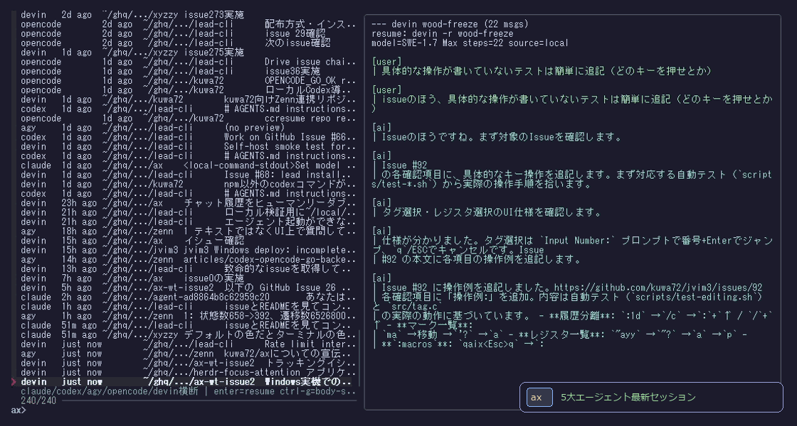

# ax — cross-agent session picker

[](https://github.com/kuwa72/ax/actions)

[日本語版 / Japanese version](README.ja.md)

`ax` lists, previews, and resumes past sessions for `claude` / `codex` / `agy` (antigravity-cli) / `opencode` / `devin` from a single fzf/JSON interface.



Existing tools (ccresume, ccsession, agf, cass, CCHV) do not cover all five, especially `devin`, so this was built from scratch. Uses only the Python standard library and works with fzf 0.44.

## Install

```sh
curl -fsSL https://raw.githubusercontent.com/kuwa72/ax/main/install.sh | sh
```

Installs the single-file `ax` script to `~/.local/bin/ax`. Requirements: `python3` and `fzf >= 0.44`. Env overrides: `AX_BIN_DIR` (install dir), `AX_REF` (git ref, default `main`).

Or clone and put it on PATH: `export PATH="$HOME/ghq/github.com/kuwa72/ax:$PATH"`

## Usage

```sh
ax                         # fzf picker (enter=resume ctrl-g=body search)
ax list [--json] [--agent NAME] [--limit N] [--no-cache] [--grep QUERY]
ax grep <query>            # cross-agent body search across all 5 -> fzf -> resume
ax preview <agent> <id> [--json]
ax resume <agent> <id>
ax rm <agent> <id> [--yes] [--hard]   # delete session (devin/codex only)
ax rename <agent> <id> --name "..."   # change display title (ax local)
ax agents                  # detection status / size / count for each store
```

`--grep` searches conversation bodies with case-insensitive ASCII substring matching and appends the hit snippet to the `title` column as `▸ <snippet>`. Inside the picker, press `ctrl-g` to switch to body search; in the search result view, `ctrl-g` starts a new search and `ctrl-a` returns to the full list (uses fzf 0.44-compatible `become`).

Add to PATH: `export PATH="$HOME/ghq/github.com/kuwa72/ax:$PATH"`

## Configuration (optional)

Write a TOML file to `~/.config/ax/config.toml` (or `$XDG_CONFIG_HOME/ax/config.toml`). Defaults are used if the file does not exist.

```toml
[limits]
max_sessions = 300
preview_lines = 30

[limits.max_sessions]
claude = 100
agy = 50

[limits.preview_lines]
devin = 20

[providers]
disabled = ["agy"]

[fzf]
extra_args = ["--bind", "ctrl-a:toggle-preview"]
```

- `limits.max_sessions`: max sessions to load in the list. Overridden by `--limit`.
- `[limits.max_sessions]`: per-provider maximum. Providers not listed use the global value.
- `limits.preview_lines` / `[limits.preview_lines]`: recent turns shown by `preview`.
- `providers.disabled`: hide from `list` / picker. `ax agents` shows them as `disabled (config)`.
- `fzf.extra_args`: additional fzf options for picker / grep (fzf 0.44 compatible only).

Invalid values print a stderr warning and fall back to defaults. A config read failure is handled the same way.

## Preview format

`ax preview` prints a chat-style view after the `--- <agent> <id> (<n> msgs)` header.

- Both user and ai turns are left-aligned for readability.
- Each turn is separated by a role-colored header and a left border (`│`).
- Each role header shows a timestamp.
- Body text is word-wrapped to the terminal width (max 80 columns) and preserves original newlines.
- Tool-only rows like `[tool: exec]` / `[tools: name]` are treated as noise and hidden.
- Role colors are auto-enabled on tty and can be forced with `AX_PREVIEW_COLOR=1` or disabled with `NO_COLOR=1`.
- Width can be fixed with `AX_PREVIEW_WIDTH`.

`--json` returns `{agent, id, preview}` for machines (no ANSI codes).

## Resume targets

| agent | command |
|---|---|
| claude | `claude --resume <id>` |
| codex | `codex resume <id>` |
| agy | `agy --conversation <id>` |
| opencode | `opencode -s <id>` |
| devin | `devin -r <id>` |

## Delete and rename

- `ax rm` confirms the target session exists, then requires a confirmation prompt (or `--yes`). In non-interactive stdin the prompt is interrupted by EOF.
  - devin → `devin rm --force <id>` (permanent delete)
  - codex → `codex archive <id>` (archive by default, restore with `codex unarchive`)
    / `--hard` → `codex delete --force <id>` (permanent delete)
  - claude / agy / opencode are not supported: exits with non-zero `not supported`. No writes are made to provider stores (files/SQLite).
- `ax rename` does not modify provider stores. It saves an ax-local display-name alias in `~/.local/share/ax/titles.json`. Use `--name ""` to clear. Works for all providers and only affects the `title` column in listings.

## Using from an agent (Agent Skill)

`ax` can be called by the agent itself. To install as a Skill for Claude / Codex / OpenCode:

```bash
# put the ax executable on PATH
export PATH="$HOME/ghq/github.com/kuwa72/ax:$PATH"

# install the skill globally
npx skills add kuwa72/ax --skill ax -g
```

Read-first workflow for the agent:

1. `ax list --json` to fetch candidates
2. Summarize `agent` / `title` / `cwd` / `epoch` and present to the user
3. If needed, `ax preview --json <agent> <id>` to show the body
4. Only run `ax resume <agent> <id>` after the user explicitly approves

JSON schema details are in `.agents/skills/ax/SKILL.md`.

## Data sources (local only)

- claude: `~/.claude/projects/*/*.jsonl`
- codex: `~/.codex/sessions/**/*.jsonl`
- agy: `~/.gemini/antigravity-cli/conversations/*.db` + `history.jsonl` + `brain/*/transcript.jsonl`
- opencode: `~/.local/share/opencode/opencode.db` (read-only, list cache in `~/.cache/ax/`)
- devin: `~/.local/share/devin/cli/sessions.db` + `transcripts/*.json` (read-only)
  - If the transcript is missing or thin, tries `devin -r <id> --export`
  - On network failure or missing `devin` binary, reconstructs local history from `sessions.db` `message_nodes`, falling back to the session title

## Limitations

- Body search is ASCII case-insensitive substring only (semantic search and persistent indexes are out of scope). JSONL files are pre-checked with mmap; `opencode.db` is scanned with `LIKE … LIMIT` on the SQLite side.
- If one provider fails, `ax` continues with the others and prints a stderr warning.
