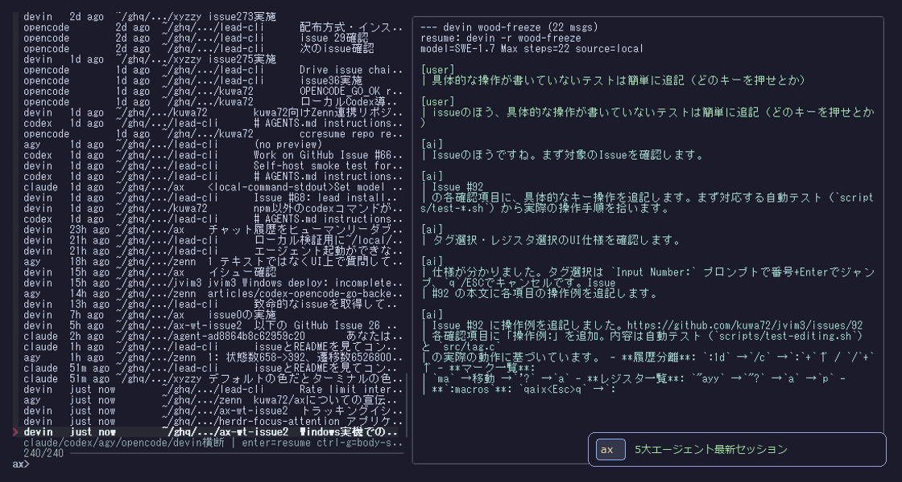

# ax — cross-agent session picker

[](https://github.com/kuwa72/ax/actions)

[日本語版 / Japanese version](README.ja.md)

`ax` lists, previews, and resumes past sessions for `claude` / `codex` / `agy` (antigravity-cli) / `opencode` / `devin` / `aider` / `goose` / `omp` (oh-my-pi) / `vibe` (mistral-vibe) / `hermes` (hermes-agent) / `crush` / `pi` from a single fzf/JSON interface.



Existing tools (ccresume, ccsession, agf, cass, CCHV) do not cover all twelve, especially `devin`, so this was built from scratch. Uses only the Python standard library and works with fzf 0.44.

## Install

```sh
curl -fsSL https://raw.githubusercontent.com/kuwa72/ax/main/install.sh | sh
```

Installs the single-file `ax` script to `~/.local/bin/ax`. Requirements: `python3` and `fzf >= 0.44`. Env overrides: `AX_BIN_DIR` (install dir), `AX_REF` (git ref, default `main`). To pin a specific version: `curl -fsSL https://raw.githubusercontent.com/kuwa72/ax/main/install.sh | AX_REF=v0.1.0 sh`

Or clone and put it on PATH: `export PATH="$HOME/ghq/github.com/kuwa72/ax:$PATH"`

## Usage

```sh
ax                         # fzf picker (enter=resume ctrl-g=body search ctrl-d=delete)
ax list [--json] [--agent NAME] [--limit N] [--no-cache] [--grep QUERY] [--regex]
ax grep <query> [--agent NAME] [--limit N] [--regex]   # cross-agent body search -> fzf -> resume
ax preview <agent> <id> [--json] [--lines N]
ax stats [--json] [--days N] [--top N]   # usage stats: per-agent counts, daily activity, top cwd
ax resume <agent> <id>
ax rm <agent> <id> [--yes] [--hard]   # delete a session (devin/codex/goose/opencode)
ax rename <agent> <id> --name "..."   # change display title (ax local)
ax agents                  # detection status / size / count for each store
```

`--grep` searches conversation bodies with case-insensitive substring matching (Unicode case folding) and appends the hit snippet to the `title` column as `▸ <snippet>`. Add `--regex` to search with a Python regex instead (e.g. `ax grep "refactor.*login" --regex`); an invalid pattern prints a stderr warning and falls back to literal matching. `ax grep <query> [--agent NAME] [--limit N] [--regex]` opens the same search in fzf directly: `--agent` restricts to one provider (unknown names return empty, like `list`), `--limit` overrides the default collect limit of 400, and only positional args form the query (e.g. `ax grep "foo bar" --agent codex` searches `foo bar`). Inside the picker, press `ctrl-g` to switch to body search; in the search result view, `ctrl-g` starts a new search and `ctrl-a` returns to the full list (uses fzf 0.44-compatible `become`). `ctrl-d` deletes the selected session: `ax rm` runs with its own confirmation prompt and the picker restarts afterwards. Deletion is available for devin / codex / goose / opencode; other providers exit with `not supported`.

Add to PATH: `export PATH="$HOME/ghq/github.com/kuwa72/ax:$PATH"`

`ax stats` prints usage statistics from session metadata only (message bodies are never read): a per-agent summary (`agent`, `sessions`, `first`/`last` epoch), daily session counts for the trailing `--days N` days (default 14), and the top `--top N` working directories (default 10). `--json` emits `{"agents": […], "daily": […], "top_cwd": […]}` for scripting. Message counts are not included: the collectors expose session metadata only.

## Configuration (optional)

Write a TOML file to `~/.config/ax/config.toml` (or `$XDG_CONFIG_HOME/ax/config.toml`). Defaults are used if the file does not exist.

```toml
[limits]
max_sessions = 300
preview_lines = 30

[limits.max_sessions]
claude = 100
agy = 50

[limits.preview_lines]
devin = 20

[providers]
disabled = ["agy"]

[providers.aider]
roots = ["~"]   # dirs scanned for .aider.chat.history.md (cwd is always added)

[fzf]
extra_args = ["--bind", "ctrl-a:toggle-preview"]
```

- `limits.max_sessions`: max sessions to load in the list. Overridden by `--limit`.
- `[limits.max_sessions]`: per-provider maximum. Providers not listed use the global value.
- `limits.preview_lines` / `[limits.preview_lines]`: recent turns shown by `preview`. Overridden by `--lines` (priority: CLI `--lines` > config > built-in default).
- `providers.disabled`: hide from `list` / picker. `ax agents` shows them as `disabled (config)`.
- `providers.aider.roots`: scan roots for `.aider.chat.history.md` (aider keeps history per-repo, no central index). Hidden dirs and heavy dirs (node_modules etc.) are pruned; depth is capped at 8.
- `fzf.extra_args`: additional fzf options for picker / grep (fzf 0.44 compatible only).

Invalid values print a stderr warning and fall back to defaults. A config read failure is handled the same way.

## Preview format

`ax preview` prints a chat-style view after the `--- <agent> <id> (<n> msgs)` header.

- Both user and ai turns are left-aligned for readability.
- Each turn is separated by a role-colored header and a left border (`│`).
- Each role header shows a timestamp.
- Body text is word-wrapped to the terminal width (max 80 columns) and preserves original newlines.
- Tool-only rows like `[tool: exec]` / `[tools: name]` are treated as noise and hidden.
- Role colors are auto-enabled on tty and can be forced with `AX_PREVIEW_COLOR=1` or disabled with `NO_COLOR=1`.
- Width can be fixed with `AX_PREVIEW_WIDTH`.

`--json` returns `{agent, id, preview}` for machines (no ANSI codes). `--lines N` (a positive integer) temporarily overrides the turn count and also applies to the `preview` string in `--json` output.

## Resume targets

| agent | command |
|---|---|
| claude | `claude --resume <id>` |
| codex | `codex resume <id>` |
| agy | `agy --conversation <id>` |
| opencode | `opencode -s <id>` |
| devin | `devin -r <id>` |
| aider | `aider --restore-chat-history` (in the repo dir; `<id>` is the history file path) |
| goose | `goose session --resume --session-id <id>` |
| omp | `omp --resume <id>` |
| vibe | `vibe --resume <id>` |
| hermes | `hermes --resume <id>` |

## Delete and rename

- `ax rm` confirms the target session exists, then requires a confirmation prompt (or `--yes`). In non-interactive stdin the prompt is interrupted by EOF.
  - devin → `devin rm --force <id>` (permanent delete)
  - codex → `codex archive <id>` (archive by default, restore with `codex unarchive`)
    / `--hard` → `codex delete --force <id>` (permanent delete)
  - goose → `goose session remove --session-id <id>` (run through a PTY; ax answers
    goose's confirm dialog only after ax's own confirmation passed)
  - opencode → `opencode session delete <id>` (also removes child sessions)
  - claude / agy / aider / omp / vibe / hermes are not supported: exits with non-zero `not supported`. No writes are made to provider stores (files/SQLite).
- `ax rename` does not modify provider stores. It saves an ax-local display-name alias in `~/.local/share/ax/titles.json`. Use `--name ""` to clear. Works for all providers and only affects the `title` column in listings.

## Using from an agent (Agent Skill)

`ax` can be called by the agent itself. To install as a Skill for Claude / Codex / OpenCode:

```bash
# put the ax executable on PATH
export PATH="$HOME/ghq/github.com/kuwa72/ax:$PATH"

# install the skill globally
npx skills add kuwa72/ax --skill ax -g
```

Read-first workflow for the agent:

1. `ax list --json` to fetch candidates
2. Summarize `agent` / `title` / `cwd` / `epoch` and present to the user
3. If needed, `ax preview --json <agent> <id>` to show the body
4. Only run `ax resume <agent> <id>` after the user explicitly approves

JSON schema details are in `.agents/skills/ax/SKILL.md`.

## Data sources (local only)

- claude: `~/.claude/projects/*/*.jsonl`
- codex: `~/.codex/sessions/**/*.jsonl`
- agy: `~/.gemini/antigravity-cli/conversations/*.db` + `history.jsonl` + `brain/*/transcript.jsonl`
- opencode: `~/.local/share/opencode/opencode.db` (read-only, list cache in `~/.cache/ax/`)
- devin: `~/.local/share/devin/cli/sessions.db` + `transcripts/*.json` (read-only)
  - If the transcript is missing or thin, tries `devin -r <id> --export`
  - On network failure or missing `devin` binary, reconstructs local history from `sessions.db` `message_nodes`, falling back to the session title
- aider: `**/.aider.chat.history.md` under `[providers.aider] roots` (Markdown; each file may hold multiple `aider chat started` blocks)
- goose: `~/.local/share/goose/sessions/sessions.db` (read-only) + legacy `*.jsonl` in the same dir not shadowed by the db
- omp: `~/.omp/agent/sessions/*/*.jsonl` (256-byte title slot + `type:"session"` header + message entries)
- vibe: `~/.vibe/logs/session/<prefix>_*/{meta.json,messages.jsonl}` (`save_dir`/`session_prefix` from `~/.vibe/config.toml`)
- hermes: `~/.hermes/state.db` (`$HERMES_HOME` respected; schema columns probed per version)
- crush: `~/.local/share/crush/projects.json` -> each `<data_dir>/crush.db` (read-only; subagent sessions with `parent_session_id` are hidden)
- pi: `~/.pi/agent/sessions/<sanitized-cwd>/*.jsonl` (first line holds `id`/`cwd`; title from the first user message)

## Limitations

- Body search is case-insensitive substring (Unicode case folding) or, with `--regex`, Python regex; semantic search and persistent indexes are out of scope. JSONL files are pre-checked with mmap; SQLite stores are pre-checked with `LIKE … LIMIT` (regex mode scans all rows of the session instead). Non-ASCII regex patterns skip the mmap prefilter and read every file, since a regex may match the `\uXXXX`-escaped form in ways a raw byte pattern cannot express.
- If one provider fails, `ax` continues with the others and prints a stderr warning.
